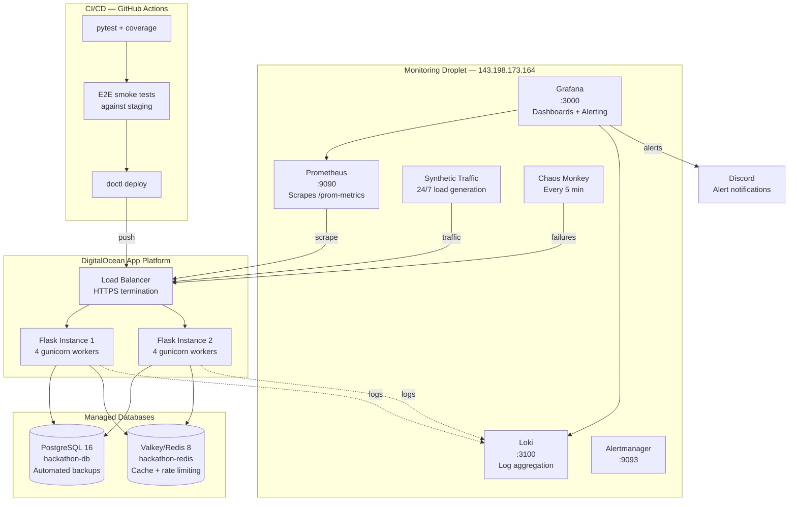

# Production Engineering Documentation

## Architecture

## Documentation Index

### Reliability Engineering
- [Error Handling](reliability/error-handling.md) — HTTP status codes, input validation, graceful error responses
- [Failure Modes](reliability/failure-modes.md) — Known failure scenarios, detection, and recovery procedures

### Scalability Engineering
- [Bottleneck Report](scalability/bottleneck-report.md) — Performance analysis and optimizations applied
- [Load Test Baseline](scalability/load-test-baseline.md) — k6 test results for Bronze/Silver/Gold tiers
- [Capacity Plan](scalability/capacity-plan.md) — Current limits, scaling strategy, and cost analysis

### Observability
- [Observability Guide](observability/observability.md) — Monitoring stack, metrics, logging, and alerting
- [Runbook](observability/runbook.md) — Incident response procedures for each alert type

### Operations
- [Deployment Guide](deployment.md) — How to deploy, rollback, and manage environments
- [Decision Log](decisions.md) — Key architectural decisions and rationale

## Quick Links

| Resource | URL |
|---|---|
| **Prod App** | https://pe-hackathon-hni9m.ondigitalocean.app |
| **Staging App** | https://pe-hackathon-staging-stj5i.ondigitalocean.app |
| **Grafana** | http://143.198.173.164:3000 |
| **Prometheus** | http://143.198.173.164:9090 |

## API Endpoints

| Method | Path | Description |
|---|---|---|
| GET | `/health` | Health check (200 OK / 503 degraded) |
| GET | `/metrics` | System metrics (CPU, memory) |
| GET | `/prom-metrics` | Prometheus exposition format |
| GET/POST | `/users` | List / create users |
| GET/PUT | `/users/:id` | Get / update user |
| GET/POST | `/urls` | List / create short URLs |
| GET/PUT | `/urls/:id` | Get / update URL |
| GET | `/r/:code` | Redirect to original URL |
| GET/POST | `/products` | List / create products |
| GET | `/events` | List analytics events |
| GET/POST | `/alerts` | List / create alerts |
| PUT | `/alerts/:id` | Update alert status |
| GET | `/logs` | Query structured logs |
| GET | `/loadtest/results` | Load test result history |
| GET | `/chaos/error` | Simulate 500 error |
| GET | `/chaos/error-flood` | Generate burst of errors |
| GET | `/chaos/cpu` | CPU spike injection |
| GET | `/chaos/latency` | Latency injection |
| GET | `/chaos/health-fail` | Simulate health failure |
| GET | `/chaos/critical` | Critical alert to Discord |

## Environment Variables

| Variable | Description | Default |
|---|---|---|
| `DATABASE_URL` | PostgreSQL connection string | — |
| `DATABASE_SSLMODE` | SSL mode for DB | `require` |
| `REDIS_URL` | Redis connection string | — (graceful degradation) |
| `FLASK_DEBUG` | Enable debug mode | `false` |
| `APP_ENVIRONMENT` | `prod` or `staging` | `dev` |
| `APP_REGION` | Deployment region label | `local` |
| `LOKI_URL` | Loki push endpoint | — (logging disabled if unset) |
| `MONITORING_IP` | Monitoring droplet IP | `143.198.173.164` |
